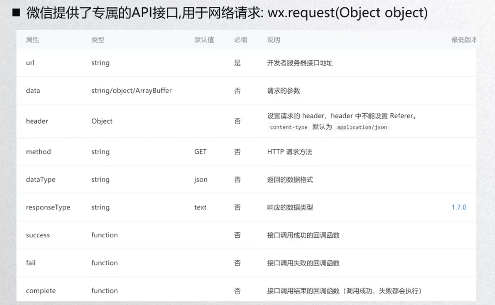

##### 小程序基本知识

+ 循环遍历：wx:for(对标vue中的v-for)

  ```html
  <view wx:for="{{array}}">{{item.name}}</view>
  ```

+ 点击 bindtap   (对标vue中的@click)

  ```html
  <button bindtap="buttonClick">按钮</button>
  ```

+ 手动设置error并抛出，适用于检验报错信息时

  ```js
  const err = new Error()
  throw err
  //这两行语句是小程序中手动创建error的方法，js中创建error也是这样创建的(已亲自测试)
  ```

+ 获取用户信息的方式

  ```js
  1.wx.getUserInfo({  //据说这个1方法快要废弃了，替代方案则是使用button的open-type属性进行获取(下面将讲解该种方法)
        success: function(res){
          console.log(res)
        },
    })
  2.button方式
  	//在wxml中，需要使用:
  	<button open-type="getUserInfo" bindgetuserinfo="函数名">获取授权</button>
  	//在对应的js文件中对应的函数定义中：
  	函数名(event){
          console.log(event)  //event中就已经包含了用户信息
      }
  3.open-data  //这个只能用来显示，无法在js文件中获取到并操作，其类型很多，具体要用的时候查看文档
  <open-data type="userNickName"></open-data>  获取用户的用户名称
  <open-data type="userAvatarUrl"></open-data>  显示用户的头像
  
  ```
  
+ wx:if   wx:elif   wx:else

+ wx:for

  ```js
  <view wx:for="{{[1,2,3]}}">{{index}}:{{item}}</view>
  <view wx:for="{{[1,2,3]}}" wx:for-item="num" wx:for-index="i">{{i}}:{{num}}</view>  跟上面等价,在多重循环时涉及到名字重复时使用这种方式
  <view wx:for="{{[1,2,3]}}" wx:key="index">{{index}}:{{item}}</view>  作用跟vue中的key一样，可以提高性能
  
  //有时候需要循环的东西如果是几个标签，那么用block标签将这几个标签包起来，然后在block标签中进行wx:for的使用，block本身没有什么意义，单独写没作用，里边加文字，跟不写标签直接写文字一样，如果定义class,写出来也没有用。   所以，大概相当于vue中的template？
  ```

  

+ .wxml文件的标签区分大小写

+ wxs   //这个东西是小程序的一套脚本语言，可以结合wxml构建出页面的结构，与js在功能定位上差不多，不过在语法上差别很大

  ```js
  //wxs使用方法
  1.在wxml组件中定义wxs标签并使用
  <wxs module="info">  //必须加module="info"
    var a = 'hello'   //这里只能用var,不能用let和const，这个var和es5中的var一样，也是变量提升，估计完全一样
    var b = 'world'
    var add = function(a,b) {
      return a + b
    }
    module.exports = {
      a:a,
      b:b,
      add:add
    }
  </wxs>
  <view>{{info.a}}</view>  使用的时候要通过info来调用
  <view>{{info.b}}</view>
  <view>{{info.add(20,30)}}</view>
  2.单独定义一个wxs文件，然后使用wxs标签引用
  <wxs src="只能用相对路径" module='info'/>
  ```

+ 小程序常见数据类型

  ```
  touchstart    手指触摸动作开始
  touchmove    手指触摸后移动
  touchcancel    手指触摸动作被打断，如来电提醒，弹窗(很少用)
  touchend    是指触摸动作结束
  tap    手指触摸后马上离开(即点击)
  longpress    手指触摸后，超过350ms再开(长按)指定了事件回调函数并触发了这个事件，tap事件将不被触发
  longtap    手指触摸后，超过350ms再离开(已经被上一个替代了,推荐使用上一个)
  ```

+ 事件对象(event)介绍（比较重要）

  ```js
      //type  String  事件类型
          即触摸事件等的具体类型，如长按、点击这种
      //timeStamp  Integer  页面打开到触发事件所进过的毫秒数
  
  区分一下target和currentTargent的区别(两者仅在冒泡触发时被冒泡触发点击的父元素中有区别,在子元素中，两者还是没有区别)
          1.target:记录产生事件的节点(如果点击子元素后冒泡导致父元素被点击，则target记录的是子元素) (好奇，如果是孙元素，冒泡两次触发的，target会是子元素呢还是孙元素)
          2.currentTarget:记录触发事件的节点(如果点击子元素后冒泡导致父元素被点击，则currentTargent记录的是父元素)
      //target  Object  触发事件的组件的一些属性值集合
      //currentTarget  Object  当前组件的一些属性值集合
  
      //detail  Object  额外的信息
  
  区分一下touches和changedTouches的区别
          1.touches：当前有几个手指在屏幕上触摸，可以记录几个点的数据
          2.changedTouches:记录变化的触摸，始终只记录一个点的数据
      //touches  Array  触摸事件，当前停留在屏幕中的触摸点信息的数组
      //changedTouches  Array  触摸事件，当前变化的触摸点信息的数组
  ```

+ 事件冒泡和事件捕获

  ```js
  //事件捕获：从最外层依次向内传
  //事件冒泡：从最内层依次向外传
  
  //使用bind会一层层的捕获和冒泡
  capture-bind:tap  //事件冒泡(注意，这个长的capture-bind:tap和capture-catch:tap的冒号不能省略，短的那个可以省略)
  bind:tap  //事件捕获
  //使用catch则会阻止事件的捕获和冒泡
  capture-catch:tap  //阻止事件冒泡
  catch:tap  //阻止事件捕获
  ```

  

+ 事件参数的传递

  在wxml文件中：

  ```html
  
  <view>
    <block wx:for="{{titles}}" wx:key="index">
      <view bind:tap="handleItenClick"
            data-index="{{index}}"
            data-item="{{item}}"
      >{{index}}-{{item}}</view>
    </block>
  </view>
  ```

  在.js文件中：

  ```js
    data: {
      titles: ['衣服','帽子','裤子']
    },
    handleItenClick(event){
      console.log(event.target.dataset)
    },
  ```

  


##### 小程序内置组件

+ Text组件

  ```html
  <!--类似于span标签，行内元素-->
  <text>Hello World\n</text>   <!--后面加\n可实现换行-->
  <!--设置文本内容是否可以被选中-->
  <text selectable="{{ture}}">Hello World\n</text>  <!--加了这个属性就可以被选中了，直接写selectable也可以，不用赋值-->
  <!--决定文本空格大小-->
  <text space='nbsp'>Hello World\n</text>  根据字体设置的空格大小
  <text space='emsp'>Hello World\n</text>  一个中文大小
  <text space='ensp'>Hello World\n</text>  半个中文大小
  
  <!--decode属性，是否解码文本-->
  <text decode>5 &gt; 3\n</text>  会被编译成5 > 3
  ```

+ button组件

  ```html
  ...
  type属性(每一种属性值代表一种默认样式)
  <button type='primary'>按钮</button>  绿色按钮白色字体样式
  <button type='default'>按钮</button>  默认样式
  <button type='warn'>按钮</button>  警告样式
  <button plain>按钮</button>  镂空效果
  <button disabled>按钮</button>  不可用
  <button loading>按钮</button>  等待效果
  
  <button hover-class='pressed'>按钮</button>  可以在.wxss文件中设置.pressed{}样式，定义点击按钮时的文本效果
  ```

+ view组件

  ```
  和div比较像
  一共就四个属性，然后基本比较常用的属性就一个hover-class属性，其他属性很少用，要用去查文档。另外的三个属性分别是用来定义点击后延迟多少时间显示点击效果，和触摸结束后延迟多久恢复原状，以及是否阻止冒泡
  ```

+ image组件(可以写成单标签也可以写成双标签，但是写单标签的时候要这样写<image/>)

  ```js
  image有个默认的高度和宽度，320*240px,与机型无关，其属性为inline-block
    
  //1.系统API，让用户在相册中选择图片或者拍照
  wx.chooseImage({
    success: function(res) {
    console.log(res)  //res中包含图片路径
    }
  })
  //2.bindload 监听图片加载完成，该属性用来绑定一个方法
//3.lazy-load属性，直接写到标签内，当图片进入到上下三屏时会加载
  //4.show-menu-by-longpress属性，开启长按图片显示识别小程序码菜单
  //5.binderror，当错误发生时触发
  //6.mode,图片拉伸模式 ，值有很多，要用的话看文档
  ```
  
    
  
+ input组件

  ```js
  很多都跟html中差别不大
  记点不一样的或者是自己不熟的
  //type属性，其值有text(文本键盘)/number(数字键盘)/idcard(身份证键盘)/digit(带小数点的数字键盘)
  //input绑定事件 ，监听聚焦和失去焦点
  	bindinput //键盘输入时触发
  	bindfocus  //聚焦
  	bindblur   //失去焦点
  	bindconfirm  //点击完成按钮时触发
  ```
  
+ scroll-view组件介绍

  ```js
  //用的时候把要滚动的区域标签包起来
  
  //水平滚动 scroll-x设置为true
  
  //垂直滚动 scroll-y设置为true
  
  //bindscroll,用来绑定一个函数事件，每次滚动都会触发该事件，而函数中默认参数event中存储有滚动的相关信息
  
  //补充一个css中自己没用过的属性white-space，这个属性声明建立布局过程中如何处理元素中的空白符
  normal 	默认。空白会被浏览器忽略。
  pre 	空白会被浏览器保留。其行为方式类似 HTML 中的 <pre> 标签。
  //(标星)nowrap 	文本不会换行，文本会在在同一行上继续，直到遇到 <br> 标签为止。
  pre-wrap 	保留空白符序列，但是正常地进行换行。
  pre-line 	合并空白符序列，但是保留换行符。
  inherit 	规定应该从父元素继承 white-space 属性的值。
  ```

+ 组件的共同属性

  ```
  跟html很想
  ```

+ templage模板组件

  ```html
  简单用法：
  <template name="temp">
    <button>按钮</button>
  </template>
  
  <template is="temp"></template>
  <template is="temp"></template>
  <template/>
  可传入数据的：
  <template name="temp">
    <button>{{btn}}</button>
    <view>{{content}}</view>
  </template>
  
  <template is="temp" data="{{btn:'按钮',content:'内容'}}"></template>
  <template is="temp"data="{{btn:'提交',content:'区域'}}"/>
  ```

  ```js
  //使用import和include可以引入模板组件
  <import src="使用相对路径或绝对路径">
      //import 导入不能递归导入，只能导入一层，无法在被导入的内容中使用导入
      
  <include src="相对路径或绝对路径"> 
      //include可以将目标文件中除了<templage/>和<wxs/>外的整个代码引入，相当于拷贝到include的位置
  include可以实现递归引入
  ```

  

##### 样式

+ 样式的三种写法：

  ```js
  wxss  页内样式(组件自己的wxss文件)和全局样式(在app.wxss中设置)
  wxml  行内样式
  wxs   //这个东西是小程序的一套脚本语言，可以结合wxml构建出页面的结构，与js在功能定位上差不多，不过在语法上差别很大
  
  // wxss文件可以使用@import导入
  
  //微信小程序提供的官方样式库：https://github.com/Tencent/weui-wxss
  ```

+ 响应式

  ```
  rpx   在iPhone6中，两个rpx刚好等于一个px,而在其他型号的手机中，rpx单位的元素会根据手机的大小情况自适应大小
  ```

  

##### 小程序数据逻辑文件结构

+ app.json文件

  ```js
  page({
  	data:{
          message: 'hello'
      },
      //这跟vue不同，不用写methods,直接跟data一个层级，定义函数就可以了
      //另外，小程序没有双向数据绑定，假如我们使用函数直接修改data中的数据的话(通过this.data.message来访问)，页面的内容并不会被修改，需要使用函数:
      this.setDate({
      	message: 'hello world'
  	})
  //进行修改才可以实现页面数据跟随data中的数据的改变而改变
  })
  ```

+ app.js文件

  ```js
  //注册一个小程序实例
  App({
    //小程序初始化完成时(这个位置只会执行一次，所以只需要执行一次的操作放到这里)
    onLaunch: function () { //注意:这里也可以加入options,且该处的options和onShow中的options是一样的
      //这里一般从来获取用户信息
      //1.获取用户信息,并将信息传递给服务器
      wx.getUserInfo({ //据说这个接口快要废弃了
        success: function(res){
          console.log(res)
        },
      })
    },
    //小程序显示出来时(这个生命周期函数每次进入时都会执行，所以需要重复执行的操作放到这里)
    onShow: function (options) {  //options中存在小程序的打开场景信息options.scene
      //1.判断小程序的进入场景
      switch(options.scene) {
        case 1001:
          //...
          break;
        case 1005:
          //...
          break
        //...
      }
    },
    //小程序隐藏时
    onHide: function () {
    },
    //小程序产生一些错误
    onError: function (msg) {
  
    },
  
    globalData:{  //在这里定义的全局数据是可以进行共享的，在其他页面中，可以通过使用getApp()获取App()产生的实例对象
      name: 'hinata',
      age: 25
    },
    //使用方法(在其他页面中)
    const app = getApp()
    cosole.log(app.globalData.name)  //'hinata'
    cosole.log(app.globalData.age) // 25
  })
  
  ```

+ 分页面的.js文件

  ```js
  
  //注册一个页面
  Page({
      // 页面的初始数据
    data: {
  
    },
      //生命周期函数--监听页面加载
    onLoad: function (options) {
      console.log('onLoad')
    },
      // 生命周期函数--监听页面初次渲染完成(注意，这个函数其实是在onShow之后被激活的，其是在逻辑层要给渲染层传递数据，等数据传递完成后数据准备显示出来时激活的)
    onReady: function () {
      console.log('onReady')
    },
      // 生命周期函数--监听页面显示
    onShow: function () {
      console.log('onShow')
    },
      // 生命周期函数--监听页面隐藏
    onHide: function () {
      console.log('onHide')
    },
      // 生命周期函数--监听页面卸载
    onUnload: function () {
      console.log('onUnload')
    },
      // 页面相关事件处理函数--监听用户下拉动作
    onPullDownRefresh: function () {
  
    },
      // 页面上拉触底事件的处理函数
    onReachBottom: function () {
  
    },
      // 用户点击右上角分享
    onShareAppMessage: function () {
  
    }
  })
  ```

  

##### 小程序配置文件内容

+ app.json中的配置

  ```js
  `具体内容看微信小程序官方文档`  // 链接：https://developers.weixin.qq.com/doc/
  1.page //用来定义项目包含的页面
  2.window //用来设置小程序的状态栏、导航条、标题、窗口背景色
  3.注意json问件中不能使用注释，不然会报错的(不知道这个是小程序独有的还是所有的json文件都这样)
  ```

##### 小程序的组件化开发

+ 自定义组件的过程

  ```js
    1.每个自定义组件的.json单独配置：
        自定义组件的.json文件中应该配置：
        {
          "component": true,   //设置为true系统才会将其视为自定义组件，这个是要在自定义组件里设置的
          "usingComponents": {
            "my-cpn":"/components/my-cpn/my-cpn"  //哪个页面用组件，把这个东西加到哪个页面里
          }
        }
        然后，要使用的时候也不用导入，直接写<my-cpn></my-cpn>就可以了
    
        //注意，因为wxml文件的节点标签名只能用小写字母、中划线和下划线的组合，所以自定义组件的标签名也只能包含这些字符。
    2.直接在app.json文件中进行配置(王老师不推荐这样用，因为到时候看着比较乱)
    	"usingComponents":{
            "my-cpn":"/components/my-cpn/my-cpn"
        }
  ```

  

+ 组件和页面样式细节

  ```js
  1.组件内的样式不会影响污染到引用组件的页面
  2.组件内不能使用id选择器、属性选择器、标签选择器
  3.如果想要相互影响，则要在自定义组件的js文件中编写如下代码：
  	Component({
  		options:{
  			styleIsolation:"isolated"  //这个是默认值，代表互相隔离，不会互相影响到
               styleIsolation:"apply-shared"  //这样设置的话，页面的样式会影响到组件的样式
               styleIsolation:"shared"  //这样设置的话，样式会相互影响
  		}
  	})
  ```

+ 给组件传递数据和样式

  ```js
  //首先是传递数据。...额，跟vue超级像。
      //自定义组件的js文件中需要写：
      1.第一种写法
          Component({
              properties:{
                  title: String
              },
              ...
          })
      2.第二种写法
          Component({
              properties:{
                  title:{
                      type:String,
                      value: '我是默认值'
                      observer: function(newVal,oldVal){  //该值发生改变时会被触发
                          console.log(newVal,oldVal)
                      }
                  }
              }
          })
      //然后，引用组件时，在组件上写：
          <my-prop title="我是传值内容"></my-prop>
  
  
  //传递样式(规则有点绕)：
  	//首先在自定义组件的wxml文件的标签中定义一个用来表示样式的类名titleclass：
  	<view class='title titleclass'></view>
  	//然后在自定义组价的json文件中写：
  		Component({
              ...,
              externalClasses: ['titleclass']  //写完这个以后就可以对titleclass赋值了
          })
      //再然后是在使用自定义组件的page中：
          <my-prop title="我是传值内容" titleclass="red"></my-prop>
          <my-prop title="我是传值内容二" titleclass="green"></my-prop>
  	//然后还要在page页的wxss文件中写：
  		.red {
              color: red;
          }
  		.green {
  			color: green;
          }
  	//这样就完成了
  ```

+ 组件向外传递事件

  ```js
  //首先在组件中的.js文件中写：
  Component({
      methods:{
          handleIncrement(){  //该函数绑定组件的触发条件
              this.triggerEvent('increment',{name:'liu',age:25},{})  //第一个{}传参数，第二个用来传一些其他的东西(用的很少，详细见文档)
          }
      }
  })
  
  //然后在page页面的.wxml文件上写：
  <my-event bind:increment="handleIncrement"></my-event>
  //最后在，page页面的.js文件中写：
  Page({
      data:{
          
      },
      handleIncrement(event){  //event中存有事件组件传递事件时定义的参数
          ... //这里写子组件传递到page后对page页的触发事件代码
      }
  })
  ```

+ 在page页获取自定义组件对象

  ```js
  1.首先在page中使用的组件标签定义一个class或者id,用来下面获取到该标签
  //然后，在page中，使用const my-sel = this.selectComponent('.CLASS' || '#ID')获取到组件对象
  //然后，使用my-sel.setData({})的方法修改组件中的数据。  这三行都是在page页的文件中编写的。
    //然后，这个方法不是很推荐使用，虽然确实是有效果的，不过不推荐，原因是不太符合官方的规范
  2.改进后的
  //在组件的js文件中定义一个专门修改组件data中数据的方法
  //然后，我们在page页获取到组件对象时，调用上一步定义的那个方法，来达到修改组件数据的目的。
  ```

+ 插槽slot

  ```js
  1.单插槽的使用跟vue一样一样的
  2.多插槽的使用
  	//首先，一样要在<slot>标签你上用name标记
  	//然后，必须在Component对象中添加一个选项：options -> multipleSlots: true
  ```

+ 自定义组件的.js文件结构内容解析（Component构造器）

  ```js
  Component({
      properties: {  //让使用者可以给组件传入数据
          observer: function(newVal,oldVal){
              
          }
      },
      data: {  //定义组件内部的初始化数据
  		counter: 0
      },
      methods: {  //定义组件内部的函数
          
      },
      options: {  //定义组件的配置选项
          multipleSlots: true   //在使用多插槽时需要将其设置为true
  	},
      externalClasses: [  //外界给组件传入额外的样式
          
      ],
      //可以监听属性的改变
  	observers: {  //相当于watch    ，上边properties中也有关于observer的使用(一个末尾有s，一个没有)，两者有些区别，注意区分
          counter: function(newVal){
              
          }
      }
      
      //组件中监听生命周期函数
      1.监听所在页面的生命周期
      pageLifetimes: {
      	show(){ //页面显现出来时加载
      		
  		},
           hide(){ //页面隐藏起来时
               
           },
           resize(){ //页面尺寸改变时(很少用)
  			
           }
  	}
      2.监听组件本身的生命周期
      lifetimes: {
          created(){  //组件被创建
              
          },
          attached  //组件被添加到页面中
          ready  //组件被渲染出来
          moved  //组件被移动到节点的另一个位置
          detached  //组件被移除掉(v-if不显示时就会触发)
      }
  })
  ```

##### 网络请求

+ wx.request

  ```js
  使用网络请求时，向接口请求数据时，接口网址必须要在小程序中进行注册。小程序只可以跟指定的域名进行网络通信(这个开发的时候可以在设置里把这个限制解除掉，不过产品上线的话就必须进行注册了)
  另外，相较于前端，小程序的网络请求还有许多限制条件，详情查看官方文档
  
  举例：
  wx.request({
  	url: 'http://123.207.32.32:8000/home/data',
      method: 'post',   //不写默认是get请求
  	data: {
  		type: 'sell',
  		page: 1
  	},
  	success: function(res){
          console.log(res)
      },
      fail: function(err) {
  		console.log(err)
      }
  })
  ```

  

+ 网络封装

  ```js
  //创建一个新的service.js文件，在其中对wx.request进行封装并返回接口：
  export default function request(options) {
      return new Promise((resolve,reject) => {
          wx.request({
              url:options.url,
              method: options.method || 'get',
              data: options.data || {},
              success: function(res){  //这里其实可以直接写成 success: resolve,
                  resolve(res)
              },
              fail: function(err){  //这里的话，也可以写成 fail: reject
                  reject(err)
              }
          })
      })
  }
  //这样就完成了封装
  
  //使用的时候：
  request({
      url: 'http://...'
  }).then(res => {
      console.log(res)
  }).catch(err => {
      console.log(err)
  })
  
  ```

+ 小程序展示弹窗

  ```js
  1.
  wx.showToast({
  	title: '早上好呀',
  	duration: 3000  //弹窗持续的时间,默认是1500
      icon: 'success'  ,//默认值是success
      image: '图片路径',//自定义图片的路径，优先级高于icon
      mask: false, //是否显示透明层，防止触摸穿透(意思是当弹窗出来时，只能点击弹窗部分，其他部分是不能点击的)
      success: function(){}, //接口调用成功的回调函数
      fail: function(){}, //接口调用失败的回调函数
      complete: function(){}//接口调用失败的回调函数(调用成功、失败都会执行)
  }) 
  //
  2.
  wx.showModal({  //这个弹窗展示不点击的话不会取消，弹窗的左下角和右下角分别是取消和确定按钮，点击后弹窗才会取消
      title: '我是标题',
      content: '我是内容，哈哈哈',
      success: function(res){  //点击确定或取消都会触发该函数(该函数的res参数中会带有具体是点击确定还是取消的信息)
          console.log(res)
          if(res.cancle){
              console.log('用户点击了取消')
          }
          if(res.confirm){
              console.log('用户点击了确定')
          }
      },
      showCancle: false, //该项默认是true，即展示取消，如果设置为false，则只有一个居中的确定按钮
      cancelText: '退出', //修改这个的话，可以定制取消按钮的文本展示为自定义的
      cancelColor: 'red',  //改颜色，只改取消的颜色，确定的在下面改
      confirmText: '',
      confirmColor: 'red',
      
  })
  
  //
  3.
  wx.showLoading({  //该东西展示后无法消失，需要调用一个wx.hideLoading来关闭
      title: '加载中',
      mask: true,  作用同showToast中国的mask
  })
  setTimeout(() => {
      wx.hiddenLoading()
  },1000)  //这样就会在一秒后消失了，不过这个东西一般用在网络请求这种不定时的东西
  
  4.
  wx.showActionSheet({
      itemList:['相册','拍照'],  //会从底下弹出一个有相册、拍照和取消按钮的弹窗
      itemColor: 'red',  //修改字体颜色，取消的字体颜色不会被修改
      success: function(res => {
          console.log(res)
  	}),
      fail: function(err => {
      	//接口调用失败时
  	}),
      complete: function(res => {
  		//成功和失败都会触发
  	})
  })
  ```

+ 小程序的页面分享功能的实现

  ```js
  //每个.js页面自带的Page({})中的最后一项onShareAppMessage用来定义关于小程序页面分享的功能
  onShareAppMessage: function(options){
      return {
          title: '转发标题',
          path: '转发路径',  //定义别人点击分享页面后的进入页面，如果不写，默认进入首页
          imageUrl:"" ,//如果没有设置，默认时首页的缩略图
      }
  }
  
  //在页面上自定义一个分享按钮
  <button open-type="share">分享</button>  //这样的话，直接点击这个按钮就进入到分享页面了
  ```

+ 小程序的登录流程

  ```js
  1.首先在app.js文件中写：
  APP({
      globalData:{  //写一个全局数据，用来存储从后台请求回来的用户登录信息
          token:''
      }
      onLaunch: function(){
      	//每次打开小程序，先从缓存中取出token，如果取不出再做请求
      	1.先从缓存中取出token
      	const token = wx.getStorageSync('token')
          2.判断token是否有值
          if(token && token.length !==0){
              this.check_token(token)  //验证一下token是否过期(专门在下边定义一个函数)
              
          }else{  //没有值，需要重新登录,调用定义好的登录函数
              this.login()
          }
      },
          
      //验证token是否过期的函数(看是否过期的好像是在自己的服务器端进行验证的)
      check_token(token){
  		wx.request({
              url: 'http://123.207.32.32:3000/auth',
              method: 'post',
              header: {
                  token
              },
              success: (res) => {
                  if(!res.data.errCode){  //token未过期
                      this.globalData.token = token
                  }else{  //token无效
                      this.login()
                  }
              },
              fail: function(err){
                  
              }
          })
      },
          
      login(){  //登录函数
  		wx.login({  //code只有五分钟有效期
              success: function(res){
                  1.获取code
                  const code = res.code
                  2.将code发送给自己服务器
                  wx.request({
                      url: 'http://123.207.32.32:3000/login',
                      method: 'post',
                      data: {
                          code
                      },
                      success: (res) => {
                          1.取出token
                          const token = res.data.token
                          2.将token保存到globalData中  //该项保存在退出后会消失，所以还要在本地做一下保存
                          this.globalData.token = token
                          3.进行本地存储
                          //wx.setStorageSync(key,data)  同步保存，
                          //wx.setStorage(key,data)  异步保存
                          wx.setStorgeSync('toke',token)
                      }
                  })
              }
          })
      }
  })
  ```

+ 页面跳转-navigator组件的使用

  ```js
  两种方法：
  1.使用navigator组件：
  	<navigator url='/pages/detail/detail'>点击跳转到详情页</navigator>  点击后就完成跳转了，且页面左上角会自动添加一个返回按钮
  	navigator的open-type属性：
  	//  默认是navigate属性，即跳转后有返回键的那种
  	//  redirect属性，重定向，关闭当前页面，跳转到路径页，没有返回键那种
  	//  switchTab,跳转到TabBar页面，并关闭其他所有非	TabBar页面。(需要是在TabBar中定义页面)
  	//  reLaunch,关闭所有的页面，打开应用中某个页面。(直接展示某个页面，并且可以跳转到tabBar页面)
  
  	跳转到的页面可以使用<navigator open-type='navigateBack'>返回</navigator>来达到点击后返回的效果(这样只能返回一步)
  	//直接返回到某个页面的做法
  	<navigator open-type='navigateBack' delta="2">返回*2</navigator>  这样的话会返回两步
  2.通过wx的API跳转
  ```

+ 页面跳转过程中数据传递（跳过去和返回后的数据传递）

  ```js
  //跳过去时传的数据
  <navigator url='/pages/detail/detail?name=why&age=18'>点击跳转到详情页</navigator>
  然后，跳转到的页面中的js文件中的onLoad函数中的options中就存有url中附带的信息
  //返回时传数据(没有特定的api，需要借助于其他的东西来实现)
      1.//准备工作，要返回的页面中的data中定义一个数据(需要通过在跳转到的页面上对要返回的页面组件中的数据进行赋值修改达到传递数值的目的)
  		data:{
  			title: '哈哈哈'
           }
      2.//同样在跳转到的页面的.js文件中：
          onUnload(){
              1.//获取首页的页面对象(getCurerntPages()函数返回所有当前活跃(栈)的页面)
              const pages = getCurrentPages()
              const home = pages[pages.length-2]  //减2表示上一个，因为减1表示最后一个，即被跳转页面
              2.//调用页面对象的setData
              home.setData({
                  title: '呵呵呵'
              })
          }
  ```

+ 通过代码进行页面跳转

  ```js
  1.//写一个按钮标签
  <button bind:tap='handlePushDetail'>跳到详情页</button>
  2.//然后在js文件定义这个函数
  handlePushDetail(){
      wx.navigateTo({
          url: '/pages/datail/detail?title=早上好啊'  //这个的传参方法和navigator标签是一模一样的
      })
  }
  3.//在跳转到的页面也写一个按钮标签
  <button bind:tap='handleBackHome'>返回</button>
  4.//在js中实现函数
  handleBackHome(){
      wx.navigateBack({
          delta: 1  //不写的话默认是1，只返回一步，可以写其他值，多返回几步
      })
  }
  ```

  